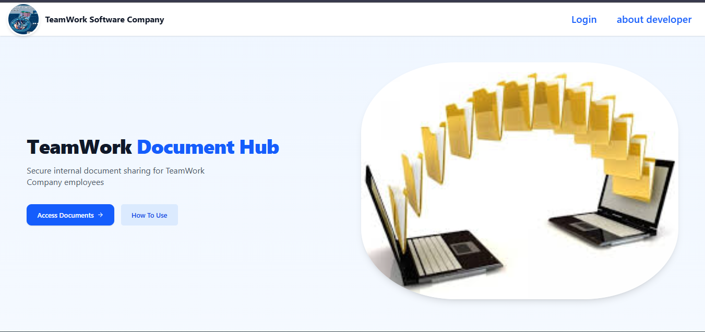
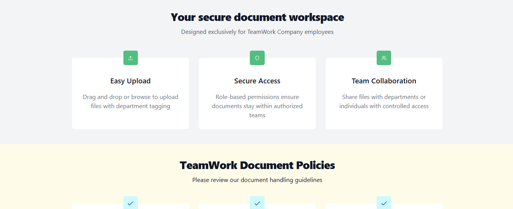
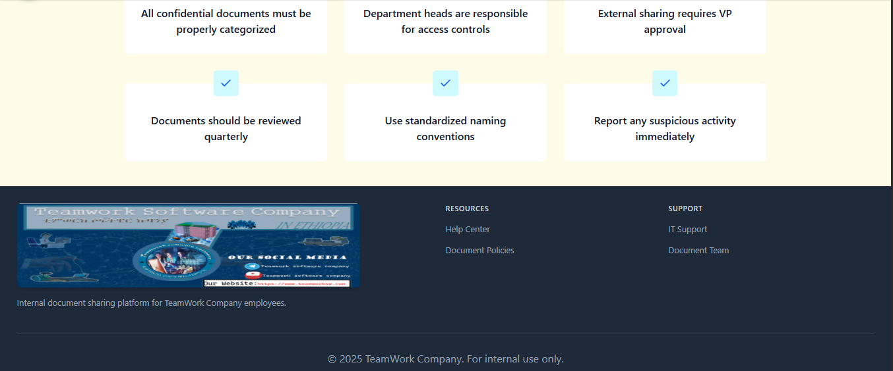
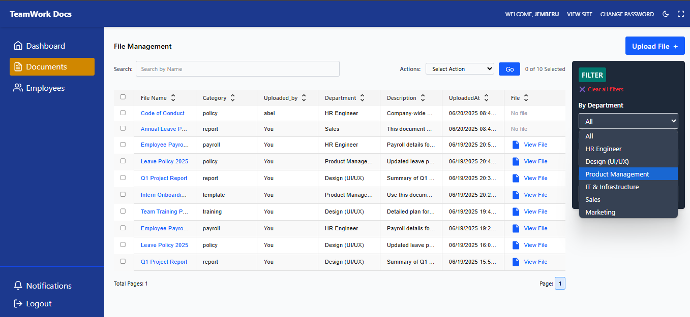
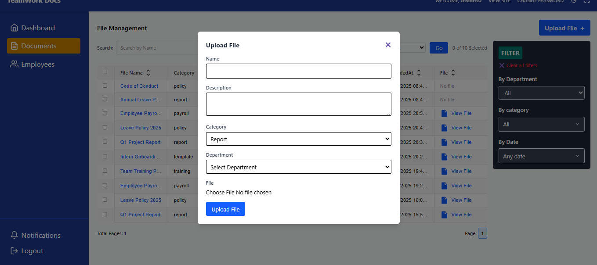
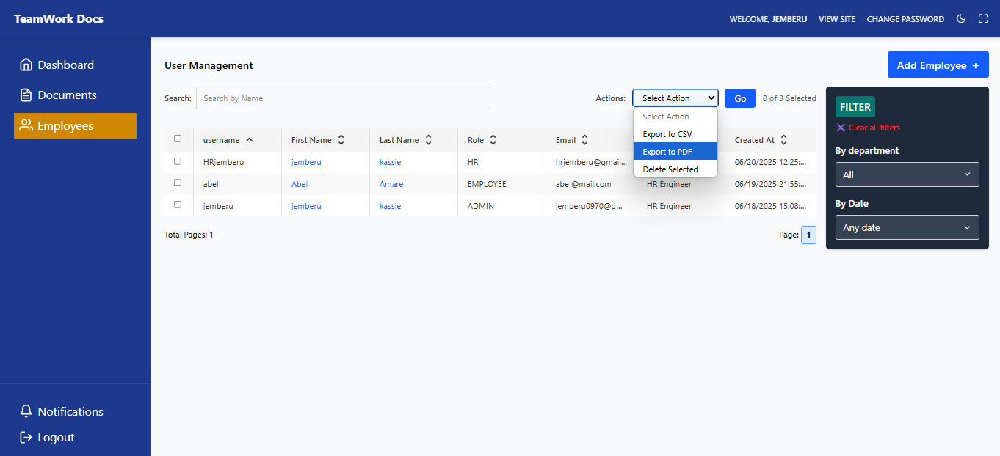

# Role-Based File Sharing System - Frontend

This is the frontend application for the **Role-Based File Sharing System for TeamWork Software Campony**, built with **React**, **Redux Toolkit (RTK)**, and **Tailwind CSS**. It allows different users (Admin, HR, Employee) to log in and manage internal document sharing securely.

## 🔗 Features

- 🔐 JWT-based authentication
- 👤 Role-based access control: Admin, HR, Employee
- 📂 Upload and view files (restricted by department for employees)
- 🔍 Search and filter functionality
- 📥 Download files
- 🔄 Change password after login

## 📁 Folder Structure

src/
├── api/ # RTK query slices for backend interaction
├── auth/ # Auth context & protected routes
├── components/ # Shared UI components
├── features/ # Redux features per domain (auth, files, users)
├── pages/ # Page components (Login, Dashboard, Upload, etc.)
├── utils/ # Helper functions (e.g., formatters, auth handlers)
└── App.js # Main app routing

## 🚀 Getting Started

### Prerequisites

- Node.js >= 16.x
- npm or yarn

### Installation

git clone https://github.com/jenberu/role-based-file-sharing-system.git
cd rbfs_frontend
npm install
Run Development Server

npm run dev

The app will run at http://localhost:5173

Technologies Used
React

Redux Toolkit

Tailwind CSS

 RTK Query

React Router DOM

JWT for authentication

Build for Production

npm run build

Authentication Flow
Admin creates employee account

Employee logs in with username/password

On first login, employee can change password

JWT is stored in localStorage for secured access

📷 Screenshots

### LandinPage 

 
 ### User DashBoard

 

### Upload file 

### For User Managemt

